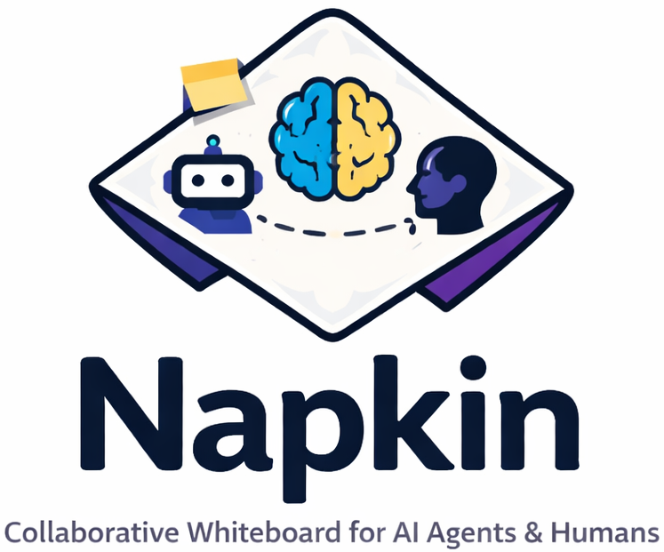
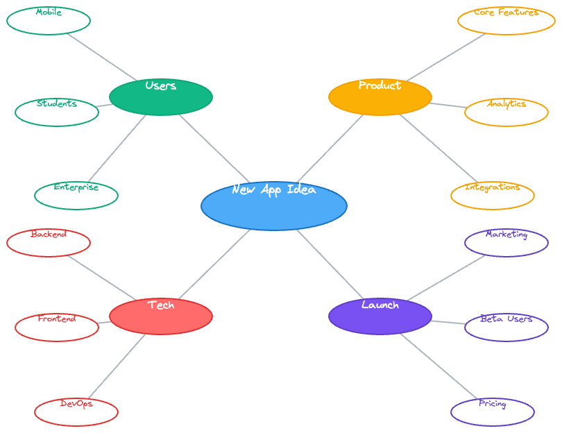
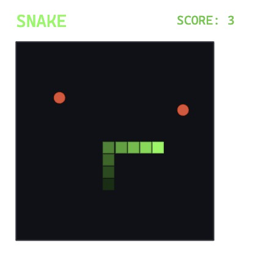
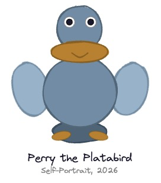
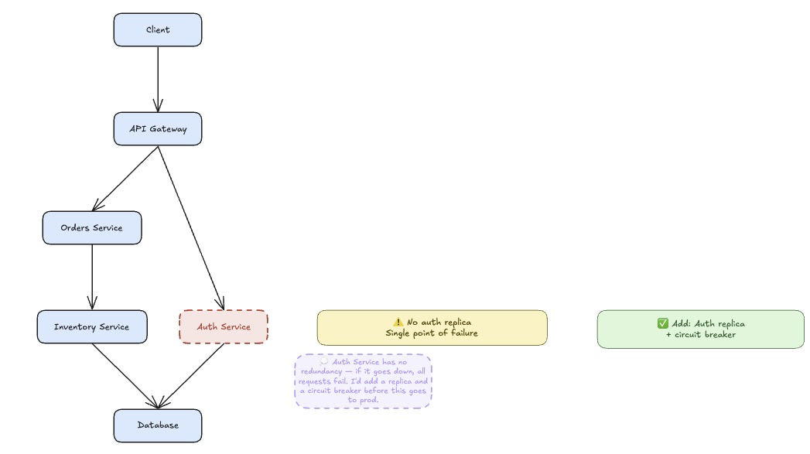
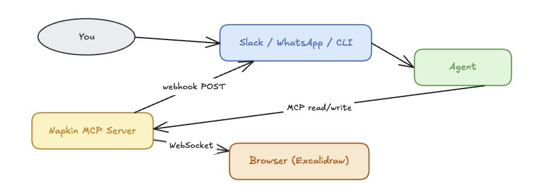

<p align="center">
  
</p>

<p align="center">
Napkin is a shared Excalidraw canvas for agent + human collaboration.
</p>

## Why We Built It
I love using AI assistants for everyday tasks — design, programming, and brainstorming. I’ve always found visual thinking helpful, but there was a gap: I could describe something, and the agent could describe it back, but we couldn’t point to the same thing. What if my agent and I could share a whiteboard — where I draw, it responds, and we build together?

Napkin works with any MCP-capable agent. For true two-way canvas-to-agent, you'll also need a webhook.

## Examples (all drawn by Perry the agent, with Napkin)

Brainstorming

<p align="center">
  
</p>

Gaming

<p align="center">
  
</p>

"Art" - Don't know why Perry invented a Platabird, but there you are.

<p align="center">
  
</p>

Collaboration

<p align="center">
  
</p>


## What It Is
Napkin is an [Excalidraw](https://excalidraw.com) whiteboard connected to an MCP server. Any MCP-capable agent can read the canvas, draw on it, annotate it, animate it, and respond to what you draw — all while you interact with the agent through your normal channel (Slack, WhatsApp, Telegram, Terminal, or any MCP client).

The conversation stays in your channel. The canvas is pure whiteboard.

<p align="center">
  
</p>


## Quick Start

### 1) Start the MCP server

```bash
cd mcp
npm install
npm run build
npm start
```

Defaults:
- MCP HTTP: `http://localhost:3003`
- WebSocket: `ws://localhost:3002`

### 2) Start the browser UI

```bash
cd ui
npm install && npm run dev
# Open http://localhost:5173
```

### 3) Connect your agent

Napkin works with any MCP-capable agent. Add to your MCP client config:
```json
{
  "napkin": {
    "type": "http",
    "url": "http://localhost:3003"
  }
}
```

**Two-way vs one-way:** MCP alone gives you agent→canvas (read, write, animate). For canvas→agent (the agent waking up when *you* draw something), you need a webhook receiver on your agent's side.

| Mode | What you get | Requires |
|------|-------------|---------|
| MCP only | Agent can read and write the canvas | Any MCP client |
| MCP + webhook | Agent also reacts to human canvas activity | Webhook receiver (see below) |

### 4) Configure the webhook (two-way only)

When you draw on the canvas, Napkin POSTs a trigger to your agent's webhook endpoint. The agent wakes up, reads the canvas diff, and responds.

**OpenClaw** — built in. Set `NAPKIN_TRIGGER_WEBHOOK` in your environment and it routes automatically.

**NanoClaw** — add the webhook channel via [PR #1488](https://github.com/qwibitai/nanoclaw/pull/1488):

```bash
# .env additions
WEBHOOK_PORT=3200
WEBHOOK_LINKED_JID=<your channel JID>   # the chat where the agent should post
```

Then pass the webhook URL when starting your session:

```
start_session({
  session_id: "<your channel ID>",
  webhook_url: "http://localhost:3200/webhook"
})
```

**Custom / other frameworks** — any HTTP server that accepts `POST /webhook` with `{ message, sender? }` JSON and forwards to your agent works fine.


## Environment Variables

Common server variables:

- `NAPKIN_TRANSPORT` (`http` or `stdio`, default `http`)
- `NAPKIN_MCP_PORT` (default `3003`)
- `MCP_WS_PORT` (default `3002`)
- `AGENT_TRIGGER_DEBOUNCE_MS` (default `3000`)
- `NAPKIN_TRIGGER_WEBHOOK` (optional global webhook URL)
- `NAPKIN_COMPACT_TRIGGERS` (`true`/`false`, default `false`)
- `NAPKIN_TRIGGER_INCLUDE_CANVAS` (`true`/`false`, default `false`)
- `NAPKIN_SESSION_TTL_MS` (default `7200000`)
- `NAPKIN_EXPORT_DIR` (optional base dir for relative exports)
- `ANTHROPIC_API_KEY` (required for vision tools only - others may be used)

See `ARCHITECTURE.md` for full details.

## Core Concepts

### The Intent API

No coordinates. No boilerplate. Describe what you want.

```
add_node("Auth Service", shape: "rectangle", metadata: { intent: "entry point" })
add_node("Token Store")
connect("Auth Service", "Token Store", label: "issues token")
layout()
```

The server handles placement, bindings, and layout. A 3-node diagram takes one short exchange.

### Reading the Canvas

`get_canvas()` returns a semantic structure — nodes, edges, zones — not raw coordinates:

```json
{
  "nodes": [
    { "id": "abc", "label": "Auth Service", "type": "box",
      "metadata": { "intent": "entry point", "status": "wip" } }
  ],
  "edges": [
    { "id": "xyz", "from": "abc", "to": "def", "label": "issues token" }
  ]
}
```

For cheap reasoning passes, `get_canvas_summary()` returns nodes and edges only — no zones, sketches, or proximity properties.

### Metadata

Every element carries a `customData` object — invisible in the UI, readable by agents:

```
add_node("Deploy Production", metadata: {
  type: "task",
  step: 8,
  owner: "platform-team",
  status: "wip"
})
```

Agents use metadata to reason about *what* elements represent, not just what they look like. `trace_path()` can filter by metadata to find specific flows.

### Triggers and Webhooks

When you draw or annotate, Napkin notices. After a quiet period, it POSTs a trigger to your agent's webhook:

```json
{
  "session_id": "slack:D0AGREPG84R",
  "source": "debounce",
  "message": "[napkin] Canvas updated (idle)",
  "changed_element_ids": ["rect-42"],
  "changed_elements_compact": [
    { "id": "rect-42", "type": "rectangle", "label": "Change the timer to 120s?" }
  ],
  "change_summary": "added text \"Change the timer to 120s?\"",
  "change_type": "semantic"
}
```

The agent wakes up, reads what changed, and responds — on the canvas and in your channel.

**Trigger sources:**
- `debounce` — canvas went quiet (configurable per session, default 3s)
- `chat` — injected by your agent framework
- `reconnect` — browser connected or reconnected

**Echo suppression:** agent writes don't trigger webhooks. Only genuine human edits fire triggers.

### Thought Bubbles

Agents express tentative ideas as thought bubbles — dashed purple, clearly "agent suggestion":

```
add_thought_bubble("Should this connect to the cache layer?", near_node_id: "db-node")
```

You can confirm them (makes permanent) or dismiss them. Keeps agent suggestions visually distinct from established content.

### Batch Execution: `apply_intents`

Collapse many sequential calls into one:

```
apply_intents([
  { tool: "add_node", args: { label: "A" }, ref: "n1" },
  { tool: "add_node", args: { label: "B" }, ref: "n2" },
  { tool: "connect", args: { from_id: "$ref:n1.id", to_id: "$ref:n2.id" } },
  { tool: "layout", args: {} }
])
```

Ref substitution (`$ref:n1.id`) lets later ops use outputs from earlier ones — no round-trips needed to get IDs. A 10-node diagram with connections and layout ships in a single MCP call.

### Swimlanes: `zone` + `row`

Pin nodes to explicit layout rows independent of edge structure. Nodes sharing the same `zone` and `row` are snapped to the same rank band after Dagre runs — useful for shared infrastructure (databases, event buses) that should sit on a common row across subtrees:

```
add_node("API",         zone: "main", row: 0)
add_node("Worker",      zone: "main", row: 0)
add_node("Postgres",    zone: "main", row: 1)   # shared infra row
connect("API", "Postgres")
connect("Worker", "Postgres")
layout("TB")
```

Row index is the rank axis (top-to-bottom in `TB`, left-to-right in `LR`). Unzoned nodes fall back to natural Dagre placement.

### Path Traversal: `trace_path`

Find flows through the graph without manual graph walking:

```
trace_path({
  from_label: "Button 1",
  direction: "downstream",
  filter: { node_metadata: { status: "error" } }
})
```

Returns ordered nodes and edges. Filter by metadata to isolate happy paths, error paths, or any subset. Combine with `apply_intents` to animate the result.

---

## Tool Examples

### Flow Diagram

```
add_node("Input")
add_node("Process")
add_node("Output")
connect("Input", "Process")
connect("Process", "Output")
layout("LR")
```

### State Machine (with animation)

```python
# Build a traffic light state machine
apply_intents([
  { tool: "add_node", args: { label: "RED",    shape: "ellipse", style: { background: "#ff6b6b" } }, ref: "red" },
  { tool: "add_node", args: { label: "GREEN",  shape: "ellipse", style: { background: "#69db7c" } }, ref: "grn" },
  { tool: "add_node", args: { label: "YELLOW", shape: "ellipse", style: { background: "#ffd43b" } }, ref: "yel" },
  { tool: "connect",  args: { from_id: "$ref:red.id", to_id: "$ref:grn.id", label: "60s" } },
  { tool: "connect",  args: { from_id: "$ref:grn.id", to_id: "$ref:yel.id", label: "45s" } },
  { tool: "connect",  args: { from_id: "$ref:yel.id", to_id: "$ref:red.id", label: "5s"  } },
  { tool: "layout",   args: { style: "LR" } }
])

# Animate the cycle
apply_intents([
  { tool: "animate_element", args: { id: "$ref:red.id", to: { opacity: 100 }, duration_ms: 700 } },
  { tool: "animate_element", args: { id: "$ref:red.id", to: { opacity: 20  }, duration_ms: 200 } },
  { tool: "animate_element", args: { id: "$ref:grn.id", to: { opacity: 100 }, duration_ms: 700 } },
  ...
])
```

### CI/CD Pipeline (real example)

22 operations — 10 nodes, 11 connections, layout — in a single MCP call. The agent then calls `trace_path` to find the happy path and animates it with another single call.

*(See `cicd-pipeline-demo.excalidraw` for the saved canvas.)*

### Responding to Human Input

A human types "Change the timer to 120s?" directly on the canvas. The agent's webhook fires. The agent reads `changed_elements_compact`, finds the text, acts on it, and responds with a thought bubble confirming the change — all without leaving the whiteboard.

---

## Agent Instructions Template

Add this to your agent's instructions (adapt webhook URL for your framework):

```
## Napkin (Collaborative Canvas)

When the napkin MCP server is available, you have a shared Excalidraw whiteboard.

**First — always call:**
  start_session({ session_id: "<your channel ID>", webhook_url: "<your webhook>" })

**Drawing — use the intent API (no coordinates needed):**
  add_node, connect, move, resize, style, add_label, delete_element, layout

**For multi-step operations:**
  apply_intents([...ops...]) — build entire diagrams in one call, chain refs

**Reading:**
  get_canvas_summary() — cheap reasoning pass (nodes + edges only)
  get_canvas() — full semantic output including zones and metadata
  trace_path(from_label, direction, filter) — graph traversal

**On webhook trigger:**
  1. add_thought_bubble() — acknowledge visually before processing
  2. Use changed_elements_compact from the payload — no round-trip needed
  3. Skip triggers with change_type "cosmetic" if you only care about structure
  4. Skip triggers with source "reconnect"

**Metadata convention:**
  intent, notes, status (wip|review|done|parking_lot), owner
```

---

## Tool Reference

### Read
| Tool | Purpose |
|------|---------|
| `get_canvas` | Full semantic canvas — nodes, edges, zones, metadata |
| `get_canvas_summary` | Compact read — nodes and edges only |
| `get_canvas_raw` | Raw Excalidraw JSON |
| `get_canvas_diff` | Elements changed since a timestamp |
| `get_pending_triggers` | Poll for triggers (pull mode) |
| `trace_path` | Traverse graph from a node, with optional metadata filtering |
| `get_server_instructions` | Compact or verbose server-side guidance for agents |

### Write
| Tool | Purpose |
|------|---------|
| `apply_intents` | Execute ordered batch of operations in one call |
| `add_node` | Add labeled node — server handles placement. Optional `zone`+`row` pin nodes to a shared layout rank (see Swimlanes). |
| `connect` | Connect nodes with an arrow |
| `move` | Move element by offset (dx, dy) |
| `resize` | Resize element, center preserved |
| `style` | Apply color, fill, opacity, stroke |
| `add_label` | Floating text near an element |
| `delete_element` | Remove element and bound text |
| `patch_canvas` | Partial field updates on existing elements |
| `update_canvas` | Add elements with full definitions |
| `clear_canvas` | Remove everything |

### Layout
| Tool | Purpose |
|------|---------|
| `layout` | Auto-arrange via Dagre (`TB`, `LR`, `tree`, `hierarchy`) |

### Thought Bubbles
| Tool | Purpose |
|------|---------|
| `add_thought_bubble` | Dashed purple tentative suggestion |
| `confirm_thought_bubble` | Make permanent |
| `dismiss_thought_bubble` | Remove |
| `list_thought_bubbles` | List current bubbles |

### Vision
| Tool | Purpose |
|------|---------|
| `describe_elements` | Render to PNG, send to Claude vision for description |
| `describe_sketch` | Convenience wrapper for freehand elements |

### Animation & Export
| Tool | Purpose |
|------|---------|
| `animate_element` | Interpolate position/size/opacity/color over time |
| `export_canvas` | Save to `.excalidraw`, `.svg`, or `.png` |

### Sessions
| Tool | Purpose |
|------|---------|
| `start_session` | Begin session with channel ID, webhook, debounce override |
| `end_session` | End session |

---

## Troubleshooting

**Canvas appears blank after agent draws something**
The browser is the source of truth. If it reconnected between your agent's write and the next read, the server cache was reset. Call `start_session` again and redraw.

**Webhook isn't firing**
Confirm `start_session` was called with the correct `session_id` and `webhook_url`. Triggers are suppressed on agent writes — only human canvas edits fire them.

**Agent can't see what I drew**
Check `get_canvas_diff` with a recent timestamp. If the browser tab was closed and reopened, the canvas state was re-synced from the browser — call `get_canvas` for a fresh read.

**`export_canvas` produces a blank file**
Export immediately after drawing — don't let the browser reconnect between the write and export calls. Use an absolute path on the host machine.

## Design Decisions

**Canvas state lives in the browser.** The server caches it for agents but the browser is the source of truth. If the server restarts, the browser reconnects and re-syncs — no data loss as long as the tab is open. Export to `.excalidraw` for persistence.

**No chat UI.** The conversation lives in your agent's channel. Napkin is a visual tool. The trigger/webhook system routes canvas events back to the right conversation automatically.

**Echo suppression.** Agent writes don't trigger webhooks. The server tracks which element IDs were written by agents and ignores browser echoes of those writes for ~2s. Only genuine human edits fire triggers.

**Per-session isolation.** Each `start_session` call gets its own debounce timer, webhook URL, and trigger context. Multiple agents can share a canvas with independent notification channels.


## Contributing

PRs welcome. The most useful directions right now: additional layout engines, integrations with other agent frameworks, and tighter agentic loop patterns. Open an issue first for anything structural.

## Security

Please review `SECURITY.md` for reporting guidance.

## License

MIT
